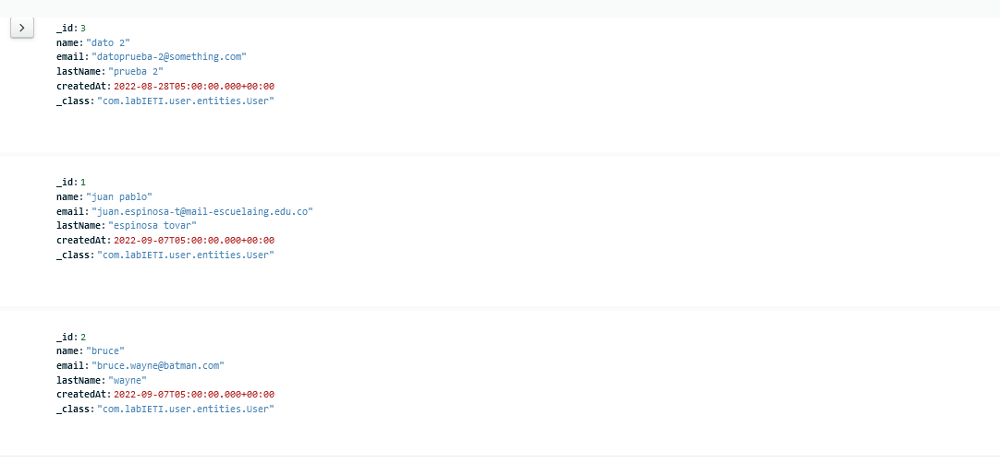
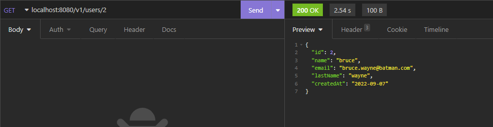
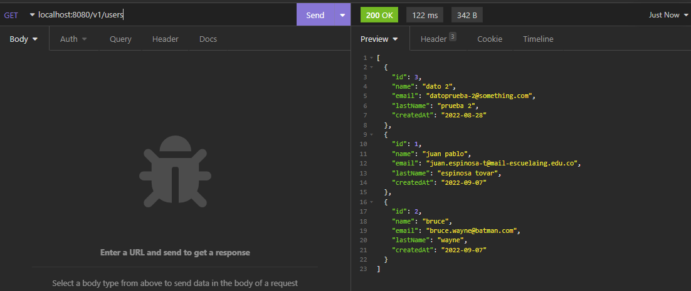
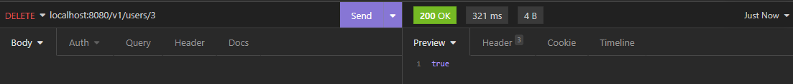
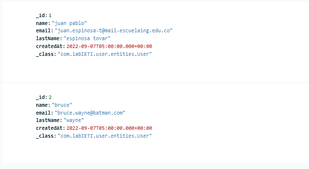
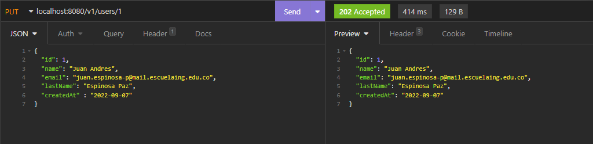
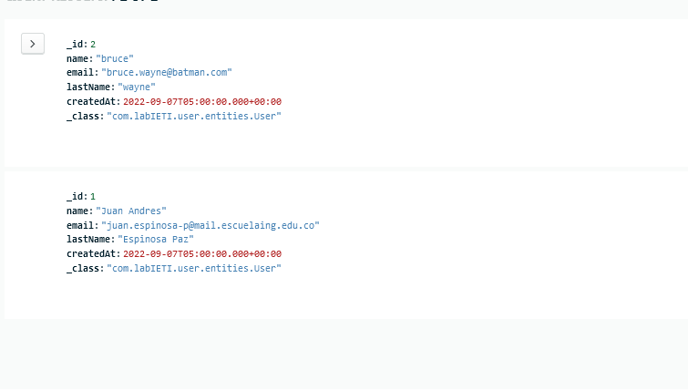

# lab02IETI_Users

## Create User:
+ Se crean los respectivos usuarios con exactamente el mismo endpoint que teníamos anteriormente
+ Miramos en MongoDB nuestros documentos guardados:

## Find Users
**vista del insomnia de User 2 y de lista de Users:**

## Delete User

+ Borramos el User con id 3

+ miramos en bd:

## Update User

+ Actualizar usuario con id 1

+ Miramos nuevamente la bd:

